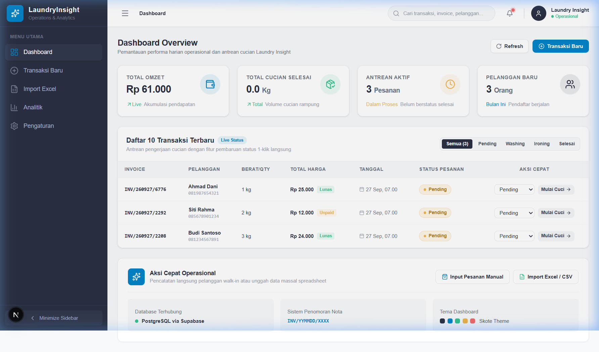
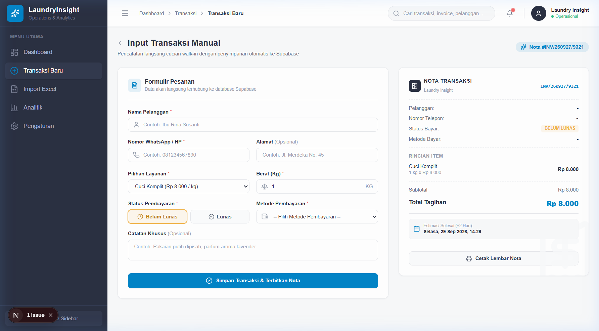
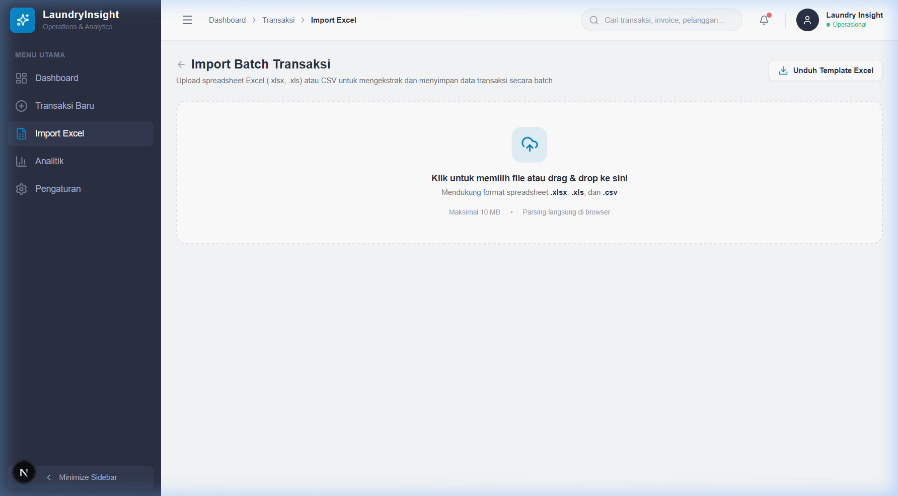
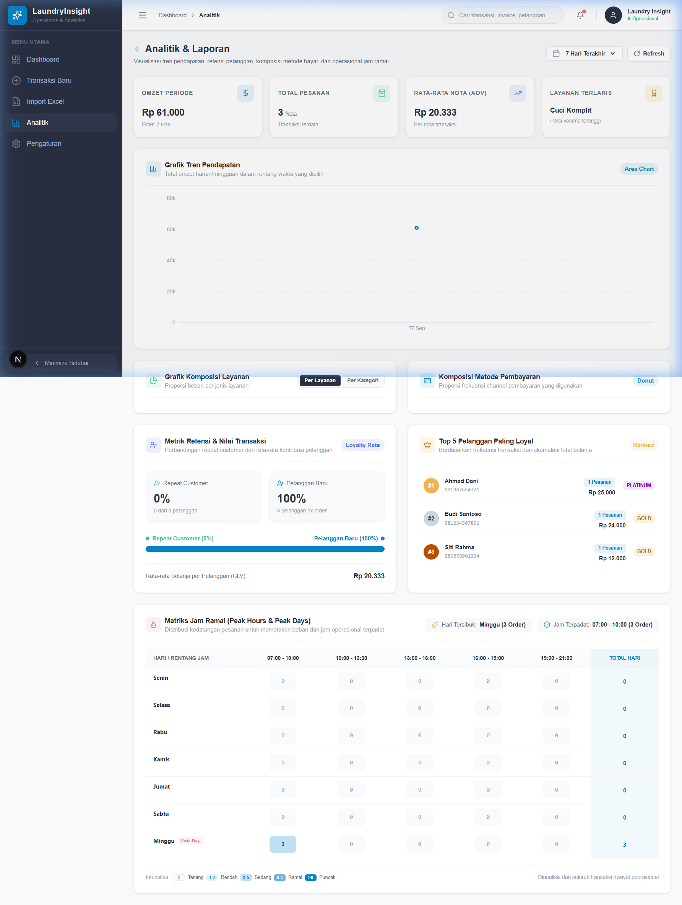
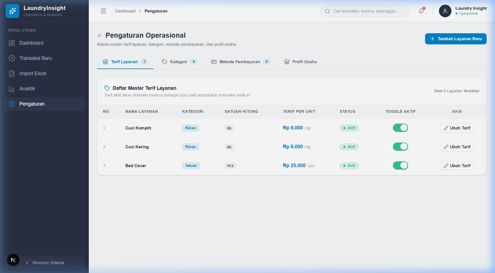

# Launderly

> **Modern Laundry Operations, Cashier POS & Business Analytics Platform**  
> Platform terpadu manajemen operasional kasir harian, batch import spreadsheet, dan analitik bisnis laundry modern.

---

<p align="left">
  <a href="https://nextjs.org"></a>
  <a href="https://www.typescriptlang.org"></a>
  <a href="https://supabase.com"></a>
  <a href="https://tailwindcss.com"></a>
  <a href="./LICENSE"></a>
</p>

---

## 📌 Tentang Project

**Launderly** adalah aplikasi manajemen operasional dan *business intelligence* modern berbasis web yang dirancang khusus untuk usaha laundry kiloan maupun satuan. Dibangun dengan estetika antarmuka profesional bertema Skote Palette (Dark Navy, Slate, dan Sky Blue), sistem ini mempermudah pencatatan transaksi kasir harian, impor data massal dari file spreadsheet, serta pemantauan antrean cucian secara *real-time*. Dilengkapi modul analitik mendalam, Launderly membantu pemilik usaha mengidentifikasi tren pendapatan harian, performa layanan terlaris, rasio pelanggan berulang, dan jam-jam sibuk operasional.

---

## 📸 Screenshot

### Dashboard Utama & Live Monitoring Antrean
Pemantauan metrik KPI harian secara real-time, status antrean cucian aktif, dan tabel transaksi terbaru.


### Formulir Kasir & Input Transaksi Walk-in
Pencatatan transaksi cepat dengan pengelompokan layanan per kategori, pilihan metode pembayaran, dan pratinjau nota instan.


### Batch Import Transaksi & Generator Template Excel
Fitur unggah spreadsheet dengan validasi otomatis per baris dan unduh file template dinamis berfitur dropdown.


### Analitik Bisnis & Business Intelligence
Visualisasi grafik tren omzet harian, matriks jam sibuk (*peak hours*), retensi pelanggan, dan komposisi layanan.


### Pengaturan Tarif & Master Data Operasional
Pengelolaan master tarif layanan per kategori, opsi metode pembayaran aktif/nonaktif, dan profil identitas outlet.


---

## ✨ Fitur Utama

- 📊 **Dashboard Real-Time**: Pemantauan metrik KPI harian (omzet berjalan, volume cucian rampung, pesanan dalam antrean, pelanggan baru) dilengkapi tabel 10 transaksi terbaru dan *inline status updater* (1-klik langsung perbarui status pengerjaan).
- ⚡ **Pencatatan Transaksi Cepat**: Formulir kasir pemesanan walk-in yang efisien dengan pengelompokan layanan per kategori, pemilihan metode pembayaran fleksibel, auto-lookup data pelanggan via nomor telepon, serta kalkulasi estimasi tanggal selesai.
- 🧾 **Pratinjau & Cetak Nota Siap Pakai**: Modal receipt transaksi instan dengan tombol cetak langsung, nomor nota otomatis unik (`INV/YYMMDD/XXXX`), dan identitas outlet dinamis.
- 📑 **Batch Import Excel Cerdas**: Unggah spreadsheet (`.xlsx`, `.xls`, `.csv`) dengan validasi otomatis per baris, pencocokan layanan & kategori otomatis, filter data invalid, serta unduhan template dinamis dengan *dropdown data validation*.
- 📈 **Analitik & Business Intelligence**: Visualisasi tren omzet harian, rasio retensi pelanggan baru vs pelanggan setia, heatmap jam sibuk (peak hours), serta diagram komposisi pendapatan per layanan, kategori, dan metode pembayaran.
- ⚙️ **Master Data & Pengaturan**: Manajemen fleksibel untuk tarif layanan, master kategori cucian, opsi metode pembayaran aktif/nonaktif, serta konfigurasi profil outlet laundry.
- 🔒 **Keamanan & Integritas Data**: Penerapan Row Level Security (RLS) di semua tabel PostgreSQL, transaksi penyimpanan atomik via stored procedure RPC `create_transaction_with_item`, serta proteksi bentrok nomor nota.
- 📱 **Desain Responsif & Premium**: Pengalaman pengguna optimal di desktop maupun perangkat mobile dengan collapsible drawer sidebar, status bar interaktif, skeleton loading, dan sistem notifikasi toast terpadu.

---

## 🛠️ Tech Stack

| Kategori | Teknologi | Keterangan |
| :--- | :--- | :--- |
| **Framework** | [Next.js](https://nextjs.org/) (App Router, Turbopack) | Framework React full-stack untuk rendering cepat, routing modular, dan performa optimal. |
| **Bahasa** | [TypeScript](https://www.typescriptlang.org/) (v5) | Type safety statis di seluruh kode aplikasi untuk meminimalkan runtime error. |
| **Styling** | [Tailwind CSS](https://tailwindcss.com/) | Styling utility-first dengan Skote Palette (`#2A3042`, `#F8F9FA`, `#0284C7`). |
| **Database** | [Supabase](https://supabase.com/) (PostgreSQL) | Database relasional dengan Row Level Security (RLS) dan Stored Procedures. |
| **ORM / Client** | `@supabase/supabase-js` | Client library resmi untuk manipulasi data dan eksekusi RPC function atomik. |
| **Excel Parser** | [SheetJS (xlsx)](https://docs.sheetjs.com/) | Parsing dan ekstraksi data spreadsheet multi-format langsung di sisi browser. |
| **Template Generator** | [ExcelJS](https://github.com/exceljs/exceljs) | Pembuatan file template Excel dinamis berfitur dropdown data validation. |
| **Visualisasi Data** | [Recharts](https://recharts.org/) | Pustaka diagram deklaratif untuk visualisasi tren omzet dan metrik bisnis. |
| **Icons** | [Lucide React](https://lucide.dev/) | Kumpulan ikon SVG konsisten, modern, dan ringan. |
| **Deployment Target** | [Vercel](https://vercel.com/) (disarankan) | Platform deployment terpadu untuk performa Next.js terbaik di lingkungan produksi. |

---

## 📂 Struktur Folder

```text
src/
├── app/
│   ├── analytics/              # Halaman Analitik, Laporan Finansial & Grafik KPI
│   │   └── page.tsx
│   ├── settings/               # Manajemen Master Kategori, Layanan, Metode Bayar & Profil
│   │   └── page.tsx
│   ├── transactions/
│   │   ├── import/             # Import Batch Spreadsheet & Unduh Template Dropdown
│   │   │   └── page.tsx
│   │   └── new/                # Formulir Kasir Walk-in & Cetak Bukti Bayar
│   │       └── page.tsx
│   ├── layout.tsx              # Shell layout aplikasi (Sidebar, Header, Navigation)
│   ├── page.tsx                # Dashboard Utama (KPI Overview & Antrean Cucian)
│   └── globals.css             # Konfigurasi Tailwind & Variabel Tema
├── components/                 # Komponen antarmuka modular (Skeleton, Modal, Badges, Toast)
├── lib/                        # Supabase client singleton, env validator, & helper functions
└── types/                      # Definisi tipe data TypeScript aplikasi
```

---

## 🚀 Panduan Instalasi & Menjalankan Project

### 1. Prasyarat Sistem
- **Node.js**: versi `18.18.0` atau yang lebih baru
- **Package Manager**: `npm`, `pnpm`, atau `yarn`
- **Database**: Akun atau project aktif di [Supabase](https://supabase.com)

### 2. Kloning Repositori & Instal Dependensi
```bash
git clone https://github.com/AbryanYoga/Launderly.git
cd Launderly
npm install
```

### 3. Konfigurasi Environment Variables
Salin file konfigurasi contoh `.env.example` menjadi `.env.local`:
```bash
cp .env.example .env.local
```

Buka `.env.local` dan masukkan URL serta API Key dari dashboard Supabase Anda (**Project Settings** > **API**):
```env
NEXT_PUBLIC_SUPABASE_URL=https://your-project-id.supabase.co
NEXT_PUBLIC_SUPABASE_ANON_KEY=your-api-key-here
```

> [!NOTE]
> Nilai untuk `NEXT_PUBLIC_SUPABASE_ANON_KEY` mendukung baik format **Publishable key** sistem baru Supabase (`sb_publishable_...`) maupun format **anon key** JWT sistem lama. Aplikasi kompatibel dengan kedua jenis kunci tersebut secara otomatis.

### 4. Eksekusi Skema & Migrasi Database
Buka menu **SQL Editor** pada dashboard Supabase Anda, lalu jalankan file skema:

- **Cara Cepat (Disarankan)**:  
  Salin dan jalankan seluruh isi file konsolidasi [`supabase/full_schema_migration.sql`](./supabase/full_schema_migration.sql). File ini telah mencakup pembuatan tabel (`categories`, `services`, `payment_methods`, `customers`, `transactions`, `transaction_items`, `settings`), indeks performa, kebijakan Row Level Security (RLS), stored procedure atomik `create_transaction_with_item`, serta data benih awal (*seed data*).

- **Cara Manual Bertahap**:  
  Jalankan file migrasi secara berurutan:
  1. `supabase/migrations/01_initial_schema.sql` (Skema tabel utama)
  2. `supabase/migrations/02_categories_payment_methods.sql` (Tabel kategori & relasi metode pembayaran)
  3. `supabase/migrations/03_rls_policies.sql` (Kebijakan RLS & RPC fungsi transaksi)

### 5. Menjalankan Server Pengembangan
Jalankan server lokal Next.js:
```bash
npm run dev
```
Akses aplikasi melalui peramban web di [http://localhost:3000](http://localhost:3000).

### 6. Build untuk Lingkungan Produksi
Untuk menguji dan membangun bundel produksi:
```bash
npm run build
npm run start
```

---

## 🤝 Kontribusi

Kontribusi pada project ini selalu terbuka. Seluruh kontribusi diharapkan mengikuti standar konvensi [Conventional Commits](https://www.conventionalcommits.org/):
- `feat:` penambahan fitur baru
- `fix:` perbaikan bug atau cacat fungsi
- `docs:` pembaruan dokumentasi
- `refactor:` restrukturisasi kode tanpa mengubah fungsionalitas
- `test:` penambahan atau pembaruan pengujian
- `chore:` pemeliharaan rutin dependensi atau konfigurasi build

Untuk detail roadmap dan arsitektur spesifikasi fungsional, silakan merujuk ke dokumen [PRD.md](./PRD.md).

---

## 📄 Lisensi

Project ini dirilis dan didistribusikan di bawah lisensi open-source **[MIT License](./LICENSE)**.  
Hak Cipta (c) 2026 Abryan Yoga.
